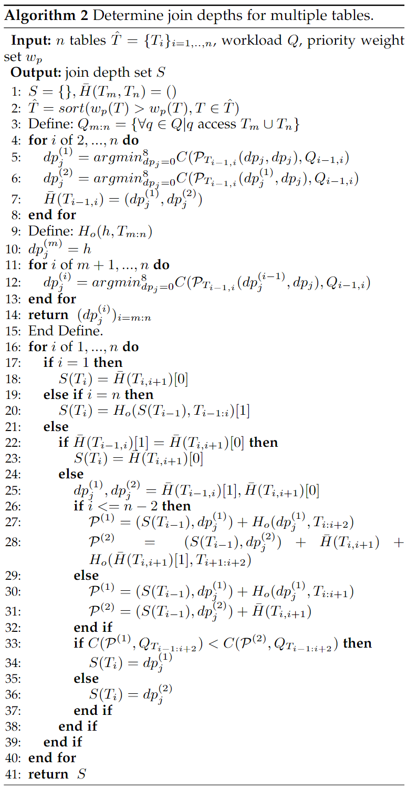

## TORN Layout for Distributed Joins

This is the source code of the paper TORN, which is mainly oriented to distributed join scenarios, optimizing the data layout for multi-table queries, single-table queries and the co-partitioning of blocks on its basis. Its main execution process is: 

a) train MLP predictor to predict historical queries _<workload_predictor.py>_; 

b) build adaptive partition trees based on predicted (multi-table and single-table) queries _<partition_algorithm.py>_; 

c) form partition files (parquet) by routing data based on partition trees _<data_routing.ipynb>_; 

d) conduct experiments using evaluation metrics _<experiment.py / experiment.ipynb>_; 

e) execute experiments on spark _<query_routing.ipynb>_.

#### 1. Project Structure

<u>Directory</u>

- **NORA_experiments** includes three directories, a) images. b) queryset. c)datasets. The *images* stores some temporary visualization files for data layout and queries. The *queryset* stores workload files that are classifies as multi_join / tpcds / tpch. The *datasets* stores some data files generated by tpc/tpcds kits which are not uploaded here due to excessive size. 
- **SIM_experiments** is the test environment of similar workload prediction, and it includes some test workloads for MLP and IFDT. 

- **PartitionLayout** is responsible for storing the partition tree files generated for tpch, tpcds, and distributed joins scenarios.

<u>Python Files</u>

- **data_helper** supports the sampling, reading, statistics and generation of table data and workload.

- **partition_tree.py**  is used to construct (hierarchical) partition tree. It also can save tree into bytes files and loads it flexibly.

- **partition_node.py** illustrates the structure of tree node and its functionality.
- partition_algorithm.py constructs the trees of provided all baselines.
- **join_until.py** supports the computation of hyper cost and provides QDG algorithm.
- **join_depths.py** supports the process of determining best depth for different trees.
- **workload_predictor.py** includes the achievements of IFDT and MLP predictor and their evaluation process.

<u>Jupyter Files</u>

- **data_routing.ipynb/ data_routing_for_join.ipynb**  use the partition tree constructed on the sampled data, write all the data to the specific parquet partition file in order according to the filter criteria of each node in the tree. The two files are tested for single-table environment and multi-table environment respectively.

- **query_routing.ipynb/ query_routing_for_join.ipynb:** After building the partitioned environment on each spark-nodes, we use SPARK-SQL to execute these workload in single-table and multi-table scenarios respectively and record the execution metrics.

- **experiment.ipynb** includes the experiments related to scalability.

- **experiment_join.ipynb** includes some experiments related to distributed joins. It is responsible for evaluating the performance of TORN and adaptdb over multi-table queries.

#### 2. HDFS and Spark environment

Users need to create their own hadoop and spark environments. The following is an template example of paths that need to be created for the HDFS file system.

<u>PATHS Template</u>

- par_data

  - tpch
    - QdTree
      - scale1
      - scale10
      - ...
    - PAW
    - TORN
    - AdaptDB
  - tpcds

  - multi_join
    - tpch
      - ...
    - tpcds

#### 3. Dependencies

The project's dependency packages are written to the requirement.txt and can be installed with the following command:

```shell
python3 -m pip install -r requirements.txt
```

#### 4. Details on determining the optimal depths of multiple trees _<experiment.py:compare_hyper_join_with_multitable>_.

Assigning reasonable depths to two levels of tree has an important impact on the quality of join tree. We define the join depth of top layer as $dp_j$. Once $dp_j$ is determined, the depth of bottom layer can be calculated by the maximum depth of the leaf node.

TORN uses a heuristic algorithm to assign $dp_j$ to each table, our core idea is: (i) Use the number of of queries accessing each table to determine the priority weight $w_p$ of each table $T$, and $w_p(T)=\sum_{q\in Q(T)}{est\ rows}/{total\ rows}$. Where $est\ rows$ is the number of scan rows of query $q$ estimated by the optimizer. (ii) Determine the order of assigning depth to each table according to the priority, and then compute the optimal candidate depth for each of the two adjacent joining tables in turn. (iii) Start multiple iterations and determining the depth of only one table per iteration. In each iteration, if there is a conflict between two optimal candidate depths of a table, multiple candidates schemes are generated based on the conflict depths and the impact of the conflicted depth on the adjacent tables, and the scheme with lowest cost is selected as the final $dp_j$ of the table. 

We define $Q_{m:n}$ to indicate that queries spanning these tables $T_m,..,T_n$. $\hat{H}(T_{i-1,i})$ represents the optimal candidate depths for adjacent tables $T_{i-1}$ and $T_i$ when no other tables are considered. $H_o(h,T_{m:n})$ represents that optimal candidate depth set for tables $T_m,..,T_n$ when $dp_j(T_m)=h$. The detailed process is described in following algorithm pseudocode. 

If $n$ is too large, the number of candidate combinations of trees with different depths will increase, which will lead to a large time overhead. TORN uses some parallelization designs to solve this problem. (i) The optimal candidate depths between different adjacent tables, such as $\bar{H}_{AB}\&\bar{H}_{CD}$ and $\bar{H}_{BC}\&\bar{H}_{DE}$, can be calculated in parallel; (ii) By leveraging the pre-saved tree structures with various depths and the cost results between various depth combinations, the time overhead of calculating hyper-join cost of new combinations will be effectively reduced.


<center></center>